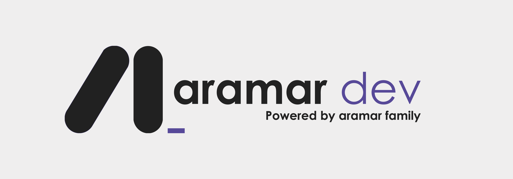

# Calibración de Recompensa Normativa y Evaluación Empírica: Modelo Ético Híbrido (CPO-RAG)

Este repositorio contiene el pipeline de datos automatizado y la metodología de evaluación para el documento de investigación: *"Modelo Ético Híbrido vía CMDP con Restricciones Axiomáticas Duras"*. 

El objetivo de este submódulo es doble. Primero, proporcionar reproducibilidad algorítmica sobre cómo se calibró la función de recompensa del agente de Aprendizaje por Refuerzo (RL). Segundo, procesar de manera transparente la validación empírica de preferencias humanas frente a las decisiones algorítmicas.

---

## 1. Fundamento Metodológico

Para evitar la inyección de sesgos arbitrarios, el sistema evalúa dos componentes críticos:

1. **Calibración Matemática (MSE):** Extrae un subconjunto *hold-out* del **ETHICS Dataset** (dominio *Justice*, Hendrycks et al., 2020) directamente desde Hugging Face. Somete estos dilemas a un proceso de *zero-shot prompting* con `Llama-3-8B-Instruct`. La divergencia se cuantifica calculando el Error Cuadrático Medio (MSE) entre la etiqueta binaria humana ($Y_i$) y la estimación continua del modelo ($\hat{Y}_i$):

$$MSE = \frac{1}{n} \sum_{i=1}^{n} (Y_i - \hat{Y}_i)^2$$

2. **Validación Humana:** Conecta en tiempo real con la base de datos de encuestados (vía Google Sheets), filtra automáticamente las respuestas inválidas mediante *Attention Checks*, y grafica la preferencia social entre la eficiencia estadística neta (RLHF) y las restricciones axiomáticas (Híbrido).

---

## 2. Arquitectura del Repositorio

El pipeline está diseñado bajo principios de mínima fricción y dependencias aisladas:

| Archivo | Descripción |
|---------|-------------|
| `evaluate_ethics_pipeline.py` | Motor de inferencia y cálculo de divergencia matemática (MSE) |
| `analyze_human_eval.py` | Procesador de la base de datos sociológica y generador de métricas visuales |
| `run_experiment.py` | Orquestador unificado que ejecuta ambos procesos secuencialmente |
| `requirements.txt` | Declaración de dependencias (flexibilizadas para compatibilidad multiplataforma) |
| `.env.example` | Plantilla para credenciales de API |
| `data/` | Directorio autogenerado que almacena los artefactos de salida auditables |

---

## 3. Guía de Reproducibilidad (Paso a Paso)

Para garantizar que los scripts funcionen independientemente de su sistema operativo y sin dañar su instalación local de Python, siga estrictamente estos pasos para crear un entorno aislado.

### 3.1. Requisitos Previos

- **Python 3.9 o superior** instalado en el sistema
- Una clave de API gratuita de [Groq Cloud](https://console.groq.com/) (para acceso a Llama-3)

### 3.2. Configuración del Entorno Virtual

#### Paso 1: Clonar el repositorio y navegar a la carpeta

```bash
git clone https://github.com/joelalejandroad/ethics-cpo-calibration.git
cd ethics-cpo-calibration
```

#### Paso 2: Crear el entorno virtual (.venv)

```bash
python -m venv .venv
```

#### Paso 3: Activar el entorno virtual

**En Windows:**
```bash
.venv\Scripts\activate
```

**En macOS / Linux:**
```bash
source .venv/bin/activate
```

> ℹ️ Sabrá que está activado cuando vea `(.venv)` al inicio de su línea de comandos.

#### Paso 4: Actualizar pip e instalar dependencias

Es crucial actualizar el gestor de paquetes para evitar errores de compilación con las librerías matemáticas:

```bash
python -m pip install --upgrade pip
pip install -r requirements.txt
```

#### Paso 5: Configurar Credenciales

Renombre el archivo `.env.example` a `.env` (o haga una copia). Abra el archivo y coloque su clave API de Groq:

```plaintext
GROQ_API_KEY="gsk_su_clave_aqui"
```

---

## 4. Ejecución del Pipeline

### Ejecución Estándar (Paper Original)

Para replicar de manera determinista los resultados exactos reportados en la publicación original (evaluando 100 dilemas bajo la semilla 42), utilice el orquestador sin modificar los parámetros:

```bash
python run_experiment.py
```

### Pruebas de Falsabilidad (Auditoría Externa)

Los investigadores externos pueden modificar la semilla de aleatoriedad o el tamaño de la muestra para verificar la robustez del modelo ante diferentes cortes del dataset. Se hace pasando argumentos al orquestador:

```bash
python run_experiment.py --seed 999 --samples 250
```

---

## 5. Interpretación de Resultados (Artefactos de Salida)

Tras una ejecución exitosa, el sistema creará automáticamente una carpeta llamada `data/`. Dentro de ella, encontrará los siguientes artefactos para su auditoría:

| Artefacto | Descripción |
|-----------|-------------|
| `results_seed_X.csv` | Registro fila por fila que contiene el escenario original del ETHICS Dataset, la etiqueta de justicia humana y el valor numérico exacto asignado por la IA. Ideal para revisión cualitativa. |
| Consola (Standard Output) | Imprimirá el Error Cuadrático Medio (MSE) calculado. |
| `human_preferences_chart.png` | Gráfica de barras lista para publicación que condensa las preferencias de los encuestados humanos tras filtrar el ruido estadístico. |

---

## 📋 Licencia

Este proyecto está disponible bajo licencia MIT. Consulte el archivo `LICENSE` para más detalles.

---

## 👨‍💻 Autor

**Joel Arana** - [GitHub](https://github.com/joelalejandroad)